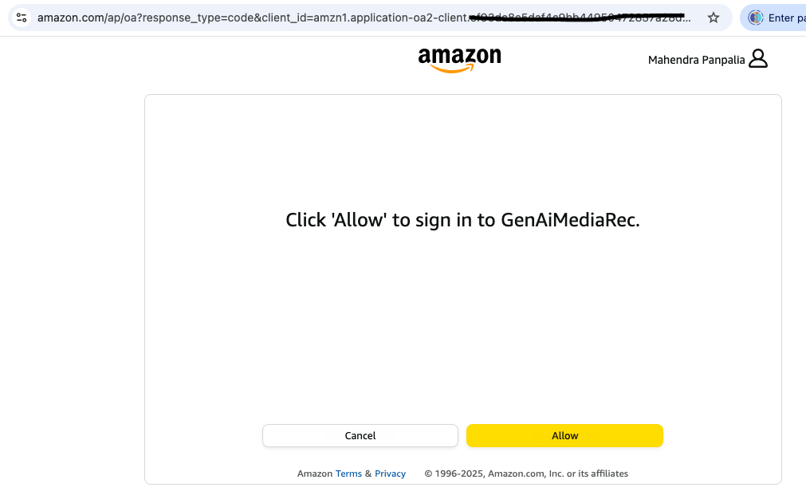
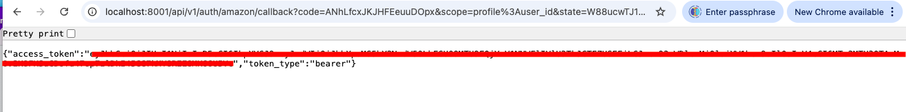
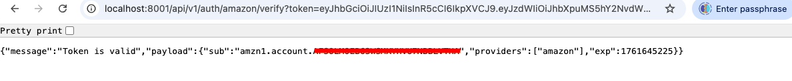

# AuthService
AuthService is written to test login authentication APIs for likes of Amazon.

* ### Folder Structure

    ```
    AuthService/
    ├── amazon/
    │   ├── app/
    │   │   ├── __init__.py
    │   │   ├── core/
    │   │   │   ├── config.py         # Handles settings and environment variables
    │   │   │   ├── security.py       # JWT and password hashing logic
    │   │   │   ├── oauth.py          # OAuth clients setup
    │   │   │   └── kafka.py          # Kafka producer/consumer
    │   │   ├── api/
    │   │   │   └── v1/
    │   │   │       └── endpoints/
    │   │   │           └── auth.py   # API routes for login, token, etc.
    │   │   ├── dependencies.py       # Dependency injection for common objects
    │   │   └── main.py               # Main FastAPI application
    │   ├── .env.example
    │   ├── Dockerfile
    │   └── requirements.txt
    ├── docker-compose.yml
    ├── README.md
    └── .gitignore
    ```

* ### Create Amazon Security Profile
    `https://developer.amazon.com/docs/app-submission-api/auth.html`

* ### How to test

    1. #### Start service
    `docker compose up`

    2. #### Following docker containers should be running in healthy state

        ```
        docker compose ps

        NAME                      COMMAND                  SERVICE             STATUS              PORTS
        amazon-auth               "uvicorn app.main:ap…"   amazon              running             0.0.0.0:8001->8001/tcp
        authservice-zookeeper-1   "/etc/confluent/dock…"   zookeeper           running (healthy)   2181/tcp, 2888/tcp, 3888/tcp, 0.0.0.0:2182->2182/tcp
        kafka_auth                "/etc/confluent/dock…"   kafka_auth          running (healthy)   0.0.0.0:9093->9093/tcp, 9092/tcp, 0.0.0.0:19093->19093/tcp
        ```
    3. #### Run APIs
        * ##### Login

        `http://localhost:8001/api/v1/auth/amazon/login`

        

        * ##### Callback
         When select `Allow` in previous call, it redirects to below
        `http://localhost:8001/api/v1/auth/amazon/callback?code=<code>&scope=profile%3Auser_id&state=<state>`

        

        * ##### Verify

        `http://localhost:8001/api/v1/auth/amazon/verify?token=<access_token>`

        

    4. ### Verify on Kafka service
    
        `docker exec -it kafka_auth bash`

        ```
        [appuser@kafka_auth ~]$ kafka-topics --bootstrap-server kafka_auth:19093 --list
        user.login
        ```


        ```
        [appuser@kafka_auth ~]$ kafka-console-consumer --bootstrap-server kafka_auth:19093 --topic=user.login --from-beginning
        {"user_id": "amzn1.account.AFSOLMOEB63WSMXYHVU7NBBLVTHA", "providers": ["amazon"], "timestamp": "2025-10-29T09:36:32.130081+00:00"}
        ```


    4. #### Stop service
    `docker compose down`
